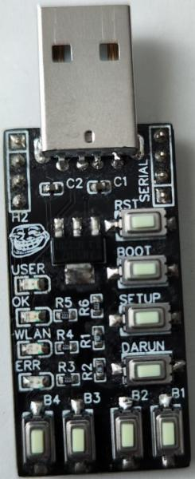
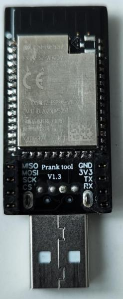

# Pranktool

## Introduction

The Pranktool is a device to simulate keystrokes on a computer (or any device that can handle a USB keyboard).
It pluggs into a USB port and pretends to be a keyboard, just that it can type much faster than a human.
its suitable for pentesting, for example, or to play a prank on your friends (as the name might suggest).

 

### Disclaimer

---

***Do not use the Pranktool for illegal activities. 
Make sure that you have the consent of all persons concerned before you use the Pranktool.***

---

## The concept

The Pranktool stores files that descripe what it should type on its simulated keyboard when you run a "[payload](#payloads)".
You can edit these files and upload new ones to fit your needs.

### Payloads

The scripts that tell the Pranktool what to type are called "payloads". They can consist of multiple files that are saved together as one "payload".
You can edit all files that belong to a payload by clicking the "edit" button next to the payload in the [Available payloads list](#available-payloads) on the [Main page](#main-page).

A simple payload script could look like this:
```
WIN R
STRING notepad.exe
ENTER
DELAY 1000
STRING Hello, world!
```
Wich opens a new text document in notepad on windows and writes "Hello, world!" into it.

### Running payloads

Running a payload will always try to run the script named <payload_name>.dd in the [payload's files](#file-list), so you need to name the file accordingly for your payload to work.
You can run payloads by pressing one of the [physical buttons](#buttons) B1 - B4 on the Pranktool after you assinged a payload to this button in the [settings](#settings). 
You can also run a payload from the [Available payloads list](#available-payloads) on the [Main page](#main-page) or from the [Payload editor](#payload-editor).

### How to access the configuration website

1. Plugg the Pranktool into a USB port.
2. Press the **[SETUP](#buttons)** button if **[WLAN on boot](#settings)** isn't enabled
3. The blue LED should ligth up if **[Enable LEDs](#settings)** is enabled
4. Connect to the WLAN Network. Default name is "*Pranktool*"
5. Enter the Pranktools IP-address *192.168.4.1* into your browser. There can be problems accessing the website if your device is also connected to a difrent network, for example through an ethernet cable.

### Updating the firmware

1. On the [Main page](#main-page), click on the [update button](#update-firmware).
2. if you got a **firmware.bin** file:
2.1. Select *"firmware"* as [OTA Mode](#update-firmware).
2.2. Click on the [Select file button](#update-firmware) and select your **firmware.bin** file
2.3. Wait for the file to upload. The Pranktool will restart whenn the upload finished.
2.4 You maybe need to [reconnect to the Pranktool](#how-to-access-the-configuration-website).
3. if you got a **littlefs.bin** file:
3.1. Select *"LittleFS/SPIFFS"* as [OTA Mode](#update-firmware).
3.2. Click on the [Select file button](#update-firmware) and select your **Littlefs.bin** file
3.3. Wait for the file to upload. The Pranktool will restart whenn the upload finished.
3.4 You maybe need to [reconnect to the Pranktool](#how-to-access-the-configuration-website).

## Hardware

The Pranktool uses a ESP32-S2 module on a custom PCB.
It has 4 LEDs and 8 buttons:

### LEDS

| Name | Color | Purpose |
|----|----|----|
| USER | Orange | Controlable by the user (Not working for unknown reason) |
| OK | Green | Indicates that a script is running
| WLAN | Blue | Indicates if WLAN is active|
| ERR | Red | Indicates an error while executing a payload |

### Buttons

| Name | Purpose |
|----|----|
| RST | Restarts the Pranktool |
| BOOT | Is used to upload new firmware through the serial interface. Not used normaly. |
| SETUP | Activates / Deactivates WLAN |
| DARUN | When pressed disables automatic payload execution after the pranktool is plugged in |
| B1 - B4 | Executes the corresponding payload as configured in the settings |

## Software

### Main page

#### Settings

The settings can be saved clicking the "*Save settings*" Button.
| Setting | Description | Default |
|----|----|----|
| Autostart | Selects a payload to be automaticly executed after the Pranktool is inserted | OFF |
| Button 1 - 4 | Selects a payload to be executed if one of the corresponding Buttons is pressed | - |
| Delay multiplier | Multiplies all delays in payloads with the given factor. Usefull for slow computers | 1 |
| WLAN name | The SSID of the WLAN network. Applies after reactivating WLAN. | Pranktool |
| WLAN password | The password of the WLAN network. At least 8 letters. Leave blank for an open network. Applies after reactivating WLAN. | *empty (no password)* |
| Hide WLAN | Specifies if the WLAN network shoul be hidden. Applies after reactivating WLAN. | Disabled |
| WLAN on boot | When enabled automaticly activates WLAN after power up | Enabled |
| Enable LEDS | LEDs won't light up when disabled. Usefull for more stealthy operation | Enabled |

#### Available payloads

This List shows all payloads that are saved on the Pranktool. You have three options:
| Button | Action |
|----|----|
| Edit | Enters the [payload editor](#payload-editor). |
| Run | Executes the payload. |
| Delete | Removes the payload from the Pranktool. Asks for confirmation. |

#### New payload

Gives you the option to create a new payload. Enter the name of the new payload in the dialog. Automaticly redirects you to the [payload editor](#payload-editor).

#### Update firmware

Clicking this button redirects to the [ElegantOTA update page](#firmware-update-page).

### Payload editor

The payload editor allows you to edit payloads and its files.

#### File list

All files that belong to this payload are listed here.
| Button | Action |
|----|----|
| Edit | Loads the content of the file into the [text area below](#edit-area) for editing. *Make shure to save the current file if modified!* |
| Delete | Removes the file from the Pranktool. ***Does not ask for confirmation!*** |

#### Other buttons

| Button | Action |
|----|----|
| Upload new file | Uploads a new file to this payload. |
| Save | Saves the changes made to the current file. |
| Run | Executes the payload (the <payload_name>.dd file). |
| Back | Returns to the [Main page](#main-page). *Make shure to save the current file if modified!* |

#### Edit Area

Modify the contents of files here.

### Firmware Update page

The Pranktool uses the ElegantOTA library for updating firmware. How to do firmware updates is descriped [here](#updating-the-firmware).

| Option | Purpose |
|----|----| 
| Select File | Select the update file here. *Make shure to select the correct [OTA Mode](#ota-mode) first!* |
| OTA Mode | Selects whether to update the firmware or the filesystem. *Refer to [How to Update](#updating-the-firmware) to select the right one.* |
| Dark UI | Selects between darkmode and ligthmode (only on the update page). ***Keep this setting enabled to prevent damage to your eyes!*** |

# Script language description

The script language used by the Pranktool is similar to Duckyscript tm, but has fewer features.
The commands are not case-sensitive, the arguments are. 
Small example:

```
WIN r
DELAY 500
STRING cmd
ENTER
DELAY 500
STRING echo hello world!
ENTER
DELAY 2000
ALT F4
```

## List of available commands

### STRING
`STRING <text>`
types the given text.

### PASTE
`PASTE <file>`
types the content of the given file. The file needs to be in the same payload as the script.

### Standalone keys
`<key> [<key2>, <key3>, ...]`
Presses the given key. You can also specify multiple keys to be pressed together, for Example: `CTRL ALT DEL`
The following keys are available: 
|Name|Key|
|----|----|
|`ALT`| Alt |
|`END`| End |
|`F1` - `F24`| Function keys |
|`GUI`| GUI key |
|`TAB`| Tabulator |
|`AKUT`| ` |
|`HOME`| Home key |
|`ALTGR`| Alt gr |
|`ENTER`| Enter |
|`PAUSE`| Pause key |
|`SHIFT`| Shift |
|`APPLICATION`| Application key |
|`BACKSPACE`| Backspace |
|`CAPS_LOCK`| Capslock |
|`COMMAND`| Same as GUI |
|`CTRL`| Control |
|`DEL`| Delete |
|`DOWN`| Down arrow |
|`ESC`| Escape |
|`ESZETT`| ß |
|`GRAVIS`| ´ |
|`INSERT`| Insert key |
|`LEFT_ALT`| Left alt |
|`LEFT`| Left arrow |
|`LEFT_CTRL`| Left Control |
|`LEFT_GUI`| Left GUI |
|`LEFT_SHIFT`| Left Shift |
|`OPTION`| Option key, same as left alt |
|`PAGE_DOWN`| Page down |
|`PAGE_UP`| Page up |
|`PERIOD`| . |
|`PRINT_SCREEN`| Print screen key |
|`RETURN`| return, same as ENTER |
|`RIGHT_ALT`| Right alt |
|`RIGHT`| Right arrow |
|`RIGHT_CTRL`| Right control |
|`RIGHT_GUI`| Right GUI |
|`RIGHT_SHIFT`| Rigth shift |
|`SCROLL_LOCK`| Scroll lock key |
|`UP`| Up arrow |
|`WIN`| Windows key, same as GUI |
|`ZIRKUMFLEX`| ^ |